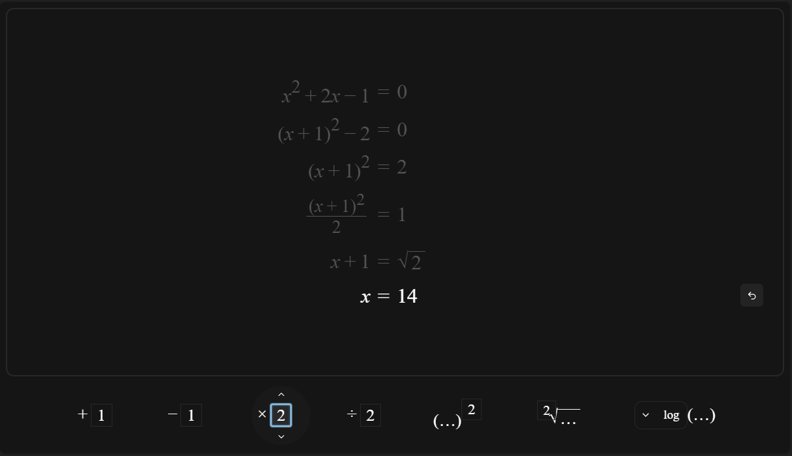
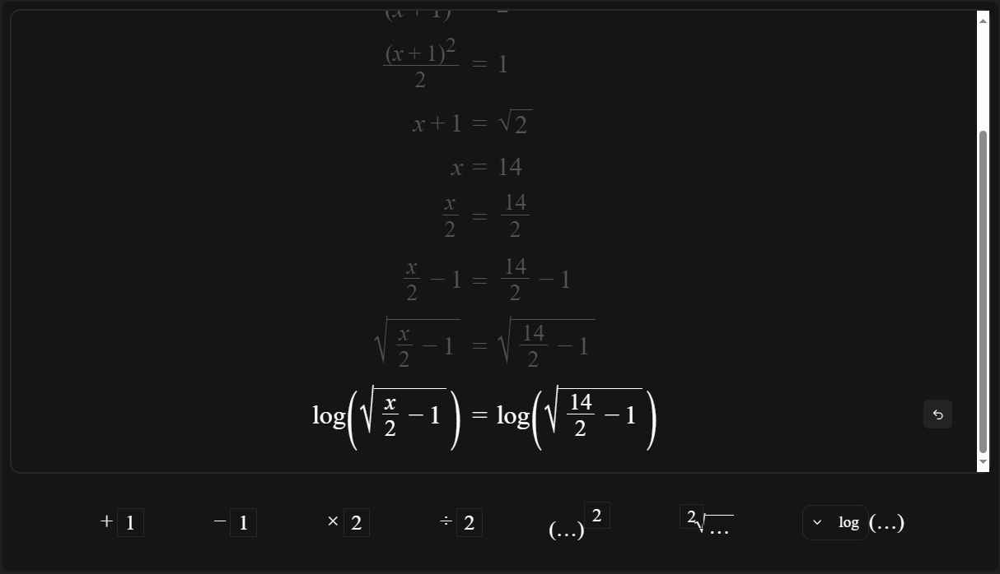
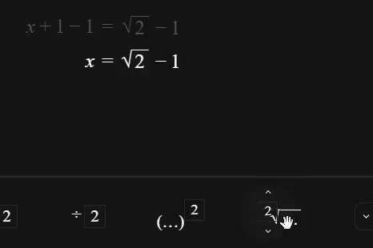
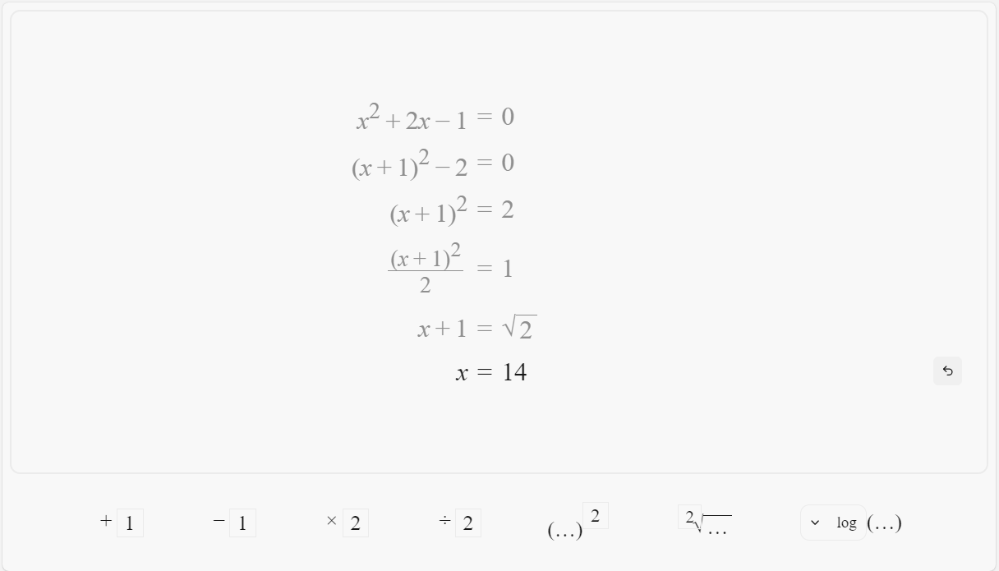
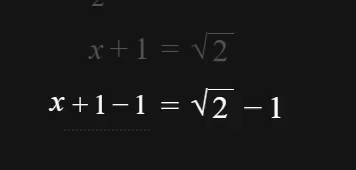

# Prototyping Documentation
> Callum Hynes

## Plan

Mr. Gibson is a (Digitech and) mathematics teacher at Cashmere High School. They would like a tool to help better teach student's understanding of algebra, including the rearrangement and solving of systems of equations. Learning such concepts can often be boring and unappealing to students, so ideally such teaching could be done in an intuitive and fun visual manner. Such a tool should freely ideally be accessible to all students and teachers alike.

## Specs

- Design a web application with a drag-and-drop based UI, similar to Scratch, to allow students to experiment with mathematical equations and expressions
- Create a visually appealing design (e.g. with animations) that maintains student interest and engagement
- Develop an intuitive interface that aids student understanding of algebra
- Draggable equation operations to facilitate interactive learning
- Should enable students to find solutions to different algebraic equations in a fun and interactive way
- Support a customisable UI, with a customisable colour theme to appeal to student's preferances.

## Solution

I intend to create a web application with an intuitive, drag-and-drop based UI (similar to <https://scratch.mit.edu>) allowing students to play with operating on mathematical equations and expressions and gain understanding to find solutions to different algebraic equations. A web application has the benefit that it is easily accessible from any device with an internet connection (or even without, using PWAs). The site will be a Single-Page Application consisting of a workspace where working can be done on an equation, and a toolbar with various operations which can be dragged onto the workspace to apply them to the equation.

## Technologies

### Server Backends

- ASP.NET
  - Pros:
    - Reasonably scalable, allowing for cost- and time-effective expansion in future, at the stakeholder's will.
    - Type safe, decreasing the possibility for bugs to escape into production, eventuating a better user experience (avoiding unexpected errors or "down for maintanence"). Also more cost-effective by reducing maintanence cost.
    - Easy-to-use routers, allowing for a fast development cycle and iteration process, so the application can be production-ready as fast as the stakeholder requires.
  - Cons:
    - C#  and .NET are made by Microsoft, subject to their development ideologies, which are quite old (not modern-day industry standard) and "feels weird" - decreased developer experience working with older models like MVC (model-view-controller) which also require large amounts of bootstrap code, increasing time-to-prod.
    - Doesn’t have great support for the more modern frameworks, such as React, decreasing interopability between server and client code, increasing development time (code duplication) and increasing the potential for bugs.
- Flask (/ other python servers)
  - Pros:
    - Extremely easy routers allowing for extremely fast development iterations, meaning the stakeholder can expect to see feedback implemented extremely quickly.
  - Cons:
    - Python is not very performant or scalable, with some, but not very good, support for multithreading etc. which would be required to allow the server to handle heavier traffic. Not neccesarily immediately relevant, but would mean that future expansion of the product market would require a rewrite.
    - Again, very little support/interopability with modern js frameworks (e.g. react), increasing development time due to code duplication across sides, and increasing the chances of bugs between the two (e.g. parser differentials if the client/server handle a request differently).
    - Only supports very janky templating, making dynamic content injection into sites risky (security-wise, possible vulnerabilities allowing users to inject malicious code to run on server/other clients).
- Next.js
  - Pros:
    - Suitable integration for modern web frameworks e.g. react, allowing for suitable integration between client and server, reducing potential for bugs and increasing development speed.
    - Easy routers, with excellent support for passing dynamic information from the server to the client, allowing for strong and safe integration between client and server data.
    - Server-Side Rendering, decreasing the FPT - the time till first "paint", when the user *sees* something. Decreasing the time the user has to wait till they see *something* on the site is good for the user experience and can drastically affect how many users leave your site before it loads, due to it "being slow".
    - Supported by Cloudflare (Worker + Pages), allowing for free hosting initially, including DDoS protection, as well as the option for scaling up easily with Cloudflare's paid plans, for possible future expansion.
    - Type safe using typescript, enforcing safer code for less bugs which could break into production, and compile-time type checking allowing for faster development.
    - Using same language on client/server allows for less code duplication in shared code, increasing development speed.
  - Cons:
    - JavaScript is a JIT-ed language, thus isn't nessecarily known for being performant. Performance could become an issue if there is high traffic hitting the server. If needed, this could be mitigated by caching content to send to clients, and spreading the workload across multiple workers, or potentially moving the server to a more performant language (e.g. Rust) further down the line.
- NodeJS http.server
  - Pros:
    - Low-level interaction with packets, alowing for high levels of customisation and much more flexible capabilities on the server. This also allows more opportunity for optimising code.
  - Cons:
    - Manual routing and handling due to the lack of any  higher-level routers etc. to handle processing. This would greatly extend the development time as a lot of development focus would need to be spent on this low-level packet management rather than on the actual product. This would also lead to more code duplication, which would end up being harder to maintain into the future.
    - Hard to scale, in case high traffic becomes an issue, scaling would have to be handled completely manually, creating more opportunity for bugs and more time/cost to develop.
 
Overall, I will use Next.js because it is supported by Cloudflare, allowing for free hosting, protection protection from DDoSes and other common vulnerabilities for free. NextJS and Cloudflare are both incredibly scalable for any future expansion or big traffic. It also has suitible integration with frontend technologies which can make development easier and faster, so that the product would be released sooner for my stakeholders.

### Frontend frameworks

- Svelte
  - Pros
    - Uses a component-based system, prefering abstraction for lessened code duplication, again decreasing development time.
    - Is a relatively simple solution, with  its simplicity often keeping relatively clean code and easy to maintain, again decreasing development time.
  - Cons
    - Uses some unusual patterns and syntax, which would take longer to get accustomed to, increasing development time. (Additionally, it's just opinion but I dislike the patterns as it is often unclear exactly *how* Svelte is handling what you give it, and can lead to some unexpected outcomes).
    - Relatively new, thus has a small community, so less documentation, support, and IDE integration.
    - Not as scalable as other solutions, such as React, due to  it's simplistic nature. This is intially alright, and even leads to  faster development, but later down the line this could become an issue as Svelte may not support some features we require.
- React
  - Pros
    - Relies heavily on components, promoting abstraction to lessen duplicated code, improving development speed.
    - Has wide support and integration for many other libraries and frameworks in the JavaScript ecosystem, decreasing the time cost should any additional functionality/features want added through the use of a library, making expansibility and maintainability increadibly flexible, even if the stakeholders' requirements change drastically.
    - Internally uses complex procedures (hydration) to ensure minimal re-rendering, only updating components when neccesary, improving performance, and leading to a better user experience.
    - Supports "Server Components", rendering an initial version of the site on the server-side as HTML, allowing for a faster first paint (visual page load) on the client, benefiting the user experience (studies show that time to first contentful paint can drastically effect user experience, see <https://web.dev/articles/fcp>). The React library then takes over rendering on the client for responsive rendering (as opposed to continually rendering on server, as some other frameworks do, which is slow).
  - Cons
    - Compiles to web code, which could hinder future expansions to other platforms (native, mobile, etc.) compared to other solutions.
- React + React Native Web
  - Pros
    - Extends React, benefits from the same component-based patterns and server side rendering, etc.
    - Compiles natively to Android and iOS, allowing for mobile support using shared code, allowing for very easy future expansion, for very little added time/cost.
  - Cons
    - Less flexible, as native does not support all the same UI components as web.
- Vanilla (HTML, CSS, JS)
  - Pros
    - Small code size, for faster load times increasing user experience.
    - Static serving, allowing for free hosting on simple hosts like Github or Cloudflare pages.
  - Cons
    - No dynamic content outside of hosting seperate API endpoints
    - Much code duplication, as HTML has no support for templating at compile time (runtime solutions exist, such as HTML &lt;template&gt; element, but has performance degradations).
    - Incredibly unscalable when it comes to large projects, due to the lack of templating or imports for splitting HTML across files or reusing segments. Slows development, and heavily hinders maintainability opf the project, making future extensions increadibly inefficient and costly.
    - Browser support varies for many web technologies, including a lot of CSS features needing prefixing to  work on all browsers, which must be done manually in vanilla CSS, whereas most frameworks automatically compile to all nessecary prefixes.
    - Little/no support for third-party libraries outside of fully switching to some kind of bundler (at which point you might as well use a framework).

Overrall, I recommend React Native Web for clean, organised, flexible and extensible codebase, as well as leaving support for future expansion (e.g. to PWAs or Mobile apps (using Expo)) in case that should ever be needed. The build process can fully integrate with Next.js and expo to make deployment directly to cloudflare increadibly quick and efficient, so that the stakeholder can expect to see results to hotfix patches in good time (e.g. in the case of severe bug-fixes or expoit patches).

### Frontend UI Frameworks

- None (Custom built)
  - Pros
    - Less dependencies, decreasing project bundle size, which can affect hosting prices e.g. with Cloudflare, as well as load time, affecting the user experience.
  - Cons
    - Requires custom-built UI elements, increasing development time
    - More likely to contain bugs, as the code will not have been as extensively tested
    - Code may need to be written for each platform independently (no cross-platform guarantees for all features: see <https://caniuse.com/>)
- Tamagui
  - Pros
    - Fully type safe with typescript support, also allowing for effective IDE integration, making development very fluid and increasing development speed.
    - Offers many shorthands so more fluent developers get a faster development experience, increasing development speed.
    - Naturally targets both mobile and web, allowing for easy expansibility to native and mobile in case of future expansion.
    - Has many prebuilt GUI components such as dialogs, buttons and menus, SVG icons, as well as theming support
    - Comes with great support for animations, offering three animation drivers to support all platforms, allowing for quick development (less development time) of fluent animations, benefitting user experience.
    - Compiles to CSS for maximal performance on web, improving user experience.
    - Very frequent updates and bug-fixes, improving developer experience, as bugs experienced are likely to be fixed library-end very quickly.
  - Cons
    - Doesn’t fully support all events cross-platform due to discrepencies between how events are gathered on platforms (e.g. mobile doesn't have mousewheel event, so platform-specific code is needed).
    - Documentation not fully complete, increasing development time.
- Tailwind css
  - Pros
    - Extensive support for CSS styles, allowing for maximal flexability in the capabilities of the UI.
    - IDE support for type-hinting, benefitting developer experience and decreasing development time
    - Well documented and large community, meaning support is readily available, increasing development speed
  - Cons
    - Doesn’t naturally support native/mobile (outside of tailwind-react-native-css), decreasing scalability (likely forcing a complete rewrite for mobile) in case 
    - Hard-to-use, everything in the library is mostly is acronyms that developers must simply remember, which can be intimidating for ne wdevelopers, and would increase the amount of time spent in development.

I recommend to use Tamagui due to it's high level of interopebility with React (Native Web) and Next.js, meaning that development should go reasonably smoothly, and the result should be easily expansible for possible future native/mobile support. Tamagui is also highly extensible and abstractable using styled() to inherit and style components in a polymorphic-like manner. Covers most UI use-cases with cross-platform code, but has extensive support for platform-dependance as well. Compiles to CSS on web, making very performant for web users. Also compiles to native android/ios UI elements when available, increasing interopability with their system’s native UI.

### Math Rendering Framework

- Custom Built
  - Pros:
    - Full control over rendering, allowing for smooth and fluent interopability with other UI elements that we create.
  - Cons:
    - Requires a lot of time to  create a fully extensive solution that covers all our needs.
    - More prone to bugs due to the less extensive testing we can put in over other  solutions, which are primarily made for math rendering and have undergone rigorous testing.
    - We do not have the capacity to test all possible use cases over all browsers, so we might miss out on some bugs due to discrepencies in how browsers handle rendering.
    - Requires our own constant support and maintanence for, as browsers update and change we will have to ensure the math rendering is always up-to-date.
- MathJax
  - Pros
    - Tried and tested solution, would "just work"
    - Well known, so plenty of documentation and community to  provide support, benefiting development speed.
  - Cons
    - Integration with React would not quite be seamless, requiring us to make a custom wrapper, which would take time and be prone to bugs.
    - No support for math input fields, just output rendering, making a suboptimal user experience.
    - In my experience, can be quite unperformant, deminishing user experience.
- MathQuill
  - Pros
    - Well-known and well-tested, (used by Desmos)
    - Open source, so free and we can contribute if any features are missing that we may need
    - Support for input fields as well as static math rendering, allowing for a all-round clean, fluent user experience.
    - Integration with react already supported through [react-mathquill](https://www.npmjs.com/package/react-mathquill) wrapper.
    - Supports embedding custom renderers within the math, which will be aligned properly. Useful (flexible) for embedding our own UI within the math.

## Build V1


> Please note the expressions shown are for testing and may not  be mathmatically correct (x does not = 14)

I chose to layout the toolbar along the bottom, as here there is the most space, and it also feels intuitive to drag stuff from down there. A horizontal scroller was used in case this should overflow, but this behaviour could also be replaced with wrapping if preferred by the stakeholder (wrapping could, however, become a problem on screens that are small in width *and* height). I experimented with a solution that would wrap up until a certain maximum height, before switching to a horizontal scrollbar, but such a solution was limited by the reduced capabilities of react native web. The rest of the content consists of a *stack*, containing the history of the solving of the equation. I chose to layout the whole history so that the user can at any point look back upon their working to see how they got where they are. The most recent equation is emphasised by highlighting it in a more contrasting color than the others, to subtly indicate where users should focus most. The most recent row also offers an "undo" button to revert the state to the previous row.

 \
The "equation stack" is hosted in it's own scrolling container so that the toolbar always sticks to  the bottom, even if the stack overflows the screen height. This container is outlined to provide and indicator of its bounds, which also defines the drop region for the draggable equation elements. Such a visual indicator of the bounds makes the drag-and-drop UI a lot more intuitive. The implementation is quite flexible, so future expansion could see multiple of these regions, having two equation stacks side-by-side, allowing for simultaneous viewing & working on both.

 \
I chose to use the drag-and-drop UI because it fit my stakeholder's needs of being intuitive for students to understand and "playful" in a way that would keep younger studdents interested. Additionally, you can see the animations presented upon dropping the action - the equation fluently jumps down from it's previous state. A future extension could see more work into this animation - it would be excessive effort, but transmorphing the text in an almost fluid-like manner could be very cool! Overall, I think the animation is clean enough to make the UI feel fluent, and the drag-and-drop nature really sells the idea that the "actions" in the toolbar are things that you can *totally* just apply whenever you want, so long as you ensure to apply it to both sides (as enforced by the design).

### Build details

#### Rendering math

For some features, it was *ideal* to be able to embed custom content *within* MathQuill's math fields. To do this, I used MathQuill's ability to embed custom "renderers" to create a target to render the embedded fields to, and then in order to maintain interopability with React components, I used React portals, which allowed the React components to remain in the React DOM while simultaneously existing in a different place in the true HTML DOM. This way I could still use React to render and update the embeds, while still rendering them inside of MathQuill elements. This functionality was entirely wrapped up in a custom wrapper component, `<MathQuillText>`, so that all of the complex integration to make this work was hidden behind an abstraction layer, and so that elsewhere in my code, all it took was passing this prop the standard latex input, *and* any HTML embeds directly as children! e.g.

```tsx
(<MathQuillText>
  \sqrt[<MathTermInput>2</MathTermInput>]{'{\\ellipsis}'}
</MathQuillText>)
```

would render the square root, with an ellipsis inside, and would *directly* render the `<MathTermInput>` component in the upper left, *n*-th root position. This is used e.g. in the equation actions in order to render the input fields within the static math. By abstracting this comploex logic into a simple, easy-to-use component, this gave the freedom to focus on higher-level details.

#### The draggable UI

The draggable UI was implemented using an abstract React component which implemented draggable behaviour. Due to the difference between how dragging is implemented natively on mobile and on web, this behaviour doesn't come for free. However, by using an abstract React component, we can implement the underlying behaviour differently for each platform. The `<Draggable>` component can then be used elsewhere throughout the codebase *without* worrying about how it's actually implemented (treating it as a black box that simply does what we want). This means that, while no mobile support is currently available, if it was later required by my stakeholder then it *could* be quite easily achived due to the flexability and extensibility of the application and React Native Web.

#### Equations

Equations are internally expressed in LaTeX, which is what MathQuill directly uses. This means that when we are modifying the expressions, we have to manipulate the LaTeX string. To do this i have used Regular Expressions (regex), as, while regex has no support for the recusive nature of nesting (with paranthesis and {}, etc.), its an increadibly efficient and fast-to-develop option which can "get the job done" in an incredibly time and cost-effective manner. Well designed regex can be much more performant than other string manipulation techniques, as regex is implemented language-level as opposed to running as JavaScript (slow!). (there are definately no large companies who have recently downfallen due to the use of regex).

#### Equation actions

For equation actions, some extra information is needed with the dragged element, namely, *exactly what should it do when it is dropped on the equation*? I have an equation action component,  which composed of a `<Draggable>` to gain the draggability behaviour, and also carrying a "transformer" function (`(input: string) -> string`) which determines what happens when the action is dropped on an equation, by accepting the current string representation (as LaTeX) and returning the newly modified one. Equation actions also render using the aforementioned `<MathTermInput>` component to embed inputs to customise the action, e.g. setting the expression to be added/multiplied, etc.

#### Action term inputs

The inputs for terms within the equations were designed with usability in mind, allowing for many different forms of intuitive input, e.g. buttons appear on hover to increment/decrement the value (assuming it is simply numeric); on web scrolling over the input field also quickly changes the value (intended for "power-users" who are fluent with the interface and prefer fast shortcuts), and of course, manually typing in an expression. Providing all of these options allows the user to tweak the values in whichever way feels most comfortable to them, making the user experience a lot smoother.

#### Equation stack

The stack is implemented with a simple flexbox container of MathQuill fields. The equations themselves are internally stored in an array of strings, which contain the LaTeX representation of the expressions. React is used to dynamically match each element in the array with an actual rendered component. This way, React automatically handles updating the rendered HTML DOM whenever the equations array is updated, efficiently adding/removing elements as needed, as opposed to a naive solution which  would rerender everything every update.

### Testing

#### Testing equation actions

The equation actions were tested to ensure all methods of tweaking the term values worked. Scrolling the mouse wheel over the input box worked as expected, tweaking the value based on the wheel delta. Using the arrow buttons also worked as expected, tweaking the value by one at a time. Typing into the input box also worked, allowing for any input, including fractional or decimal numbers, coefficients of pi, e, or other variables, or even more complex expressions.
Additionally, using delta methods of tweaking the value (buttons and scroll wheel) was tested with more complex expressions already in the input box. If the input is composed of a simple coefficient of some expression, (e.g. `2x` or `8(x - 1)^2`), then the coefficient is tweaked. In any other case, nothing happens, as it may be unclear what should be adjusted. This worked as expected. This behavior may be slightly more effective by replacing the first number found in the expression, no matter where it appears. This may be considered in future iterations.
The hover animations on the term inputs were also tested, and worked as expected, displaying on hover.
Finally, the ability to drag and drop the expressions was tested. Clicking and dragging on any point within the bounds of the action should initiate a drag (unless that part has an alternative click action, e.g. the buttons or text input). This also worked as expected.

#### Testing drop targets

When dropping an equation action on the equation stack, the appropriate action should be applied to the most recent equation. This works as expected for all actions. The drop handling should apply if the action is dropped anywhere within the bounds of the bordered drop target box. This also works as expected.

#### Color theme


 \
The site should support both a light and dark theme, based upon the current system theme. All of the fonts, UI elements, etc... should be clearly visible with appropriate contrast that they should be clearly distinguishable to most users, even with minor visual disabilities. The system-theme based theme selection works as expected, and there seem sto be sufficient contrast in both modes.

### Stakeholder feedback

Showing the site to my stakeholders, they give the following feedback:

- Some hints could be given on how to use the UI, as it can be quite unclear on what to do on first glance.
- Sometimes actions can have an effect that may feel unintuituve to a user (e.g. square-rooting both sides introducing a plus or minus). Such situations should have some kind of information card giving a more in-depth explaination of what is occuring.
- The color themes are neat, but there should be some toggle to switch between them at user will, as many users are unaware of the configuration they can make within their system/browser settings.

### Changes to make

- Scroll- and button-based action term tweaking should tweak the first number found *anywhere* within the expression, not just at the beginning.
- Dark mode theme toggle.
- UI popovers to give a tutorial on how to use the page
- UI popovers to give further information on some unintuitive situations which may need explaination

With these changes, the specifications should become:

- Design a web application with a drag-and-drop based UI, similar to Scratch, to allow students to experiment with mathematical equations and expressions
- Create a visually appealing design (e.g. with animations) that maintains student interest and engagement
- Develop an intuitive interface that aids student understanding of algebra, with clear instruction on how to use the interface.
- Draggable equation operations to facilitate interactive learning
- Should enable students to find solutions to different algebraic equations in a fun and interactive way, guided by explainations at any possibly unintuitive points.
- Support a customisable UI with easy configuuration, with a customisable colour theme to appeal to student's preferances.

## Build V2

## Fitness for purpose

My solution meets the designated specifications:

- > Design a web application with a drag-and-drop based UI, similar to Scratch, to allow students to experiment with mathematical equations and expressions
  
  This specification is met with the drag-and-drop UI, \
   \
  The UI layout differs slightly from Scratch's, but this is validated due to the layout considerations, as the bottom of the screen has more space on desktop, and is quick and easy to reach on both desktop and mobile.
- > Create a visually appealing design (e.g. with animations) that maintains student interest and engagement

   \
   \
  This specification is met by the simplistic UI, using a clean, simple, and customisable solid background and a well-thought-out layout. Additionally the fluent animations when interacting with the equations and the equation actions makes using the product feel very smooth  and keeps the user engaged.
- > Develop an intuitive interface that aids student understanding of algebra

   \
  The equation stack layout is very effective at conveying the process, showing each step along the way in a similar layout as you might see in handwritten working. The nature of the way the drag-and-drop interface works forces the user to  make actions to both sides of the equation, really reinforcing the idea that actions must be made to both sides to maintain equivilence.
- > Draggable equation operations to facilitate interactive learning.
  
   \
  The drag-and-drop UI is very intuitive, especially for younger learners, as it feels very natural to simply "grab" onto the things that you need and "put" them where you need them. It is very interactive in a way that can be captivating for user engagement.

- > Should enable students to find solutions to different algebraic equations in a fun and interactive way
  
   \
  The system of having a toolbar where the user can access any operations really gives the user some freedom to find the solution *their* way, so that they can really make sense of what is happening and come to the solution in their own way.
   \
  The UI also helps them along the way by offering simplifications which can be made, so that the user can make their way back down to the final answer. These features give the user a wonderful opportunity to learn as they find the solution and to do so in an engaging and intuitive manner.

### Integration

Overall, I think the techniques integrate together quite well to make an overall fun, intuitive UI. The drag-and-drop nature works really well with the animations in order to create a very fluent design, which feels very natural to use. This keeps the user engaged; meanwhile the way the interface is thought out is constricting enough that the user cannot make any fatal errors, while still giving enough freedom allowing the user to find their own way to the solution, which is a fundamental aspect to their learning. The technologies used to create the product have integrated really nicely as well, Tamagui for UI has offered a lot to make the interface as visually appealing as it is, and has worked rewally well with React Native Web, making the codebase incredibly flexible while remaining perfectly clean and type-safe code. The majority of the UI is already in a state to support future expansions to native desktop or mobile apps (only really lacking support for rendering math natively). React has also worked very nicely with the Next.js backend, the interactions between the two are near seamless. Along with using Cloudflare for hosting, building and deploying has been incredibly seamless, using Continuous Integration on Github and some VSCode extensions, I can deploy right from my IDE. Additionally, Next.js and Cloudflare have great support for local development, overall giving a very clean and tidy developer experience, and greatly benefiting the speed at which I could develop this for the stakeholder. I think the setup with Next.js - Cloudflare - React was certainly the best option for hosting and serving, as they are a relatively well known combo (2024 is know among javascript devs as the "year of serverlessness", refering to hosting everything on the edge using e.g. Cloudflare workers), with great support from community and frequent updates. React is by far the largest modern JS framework and has come to be industry standard, being used for almost anything nowadays.

### Considerations

#### Technical and Social acceptability

Much consideration has been put into the code aspect to ensure it adheres to modern-day technical conventions. Typescript was used, which ensures that code is type-safe, ensuring the code is clean and easy to  understand. Using typescript properly can prevent bugs and make maintanence much easier further down the line. Conventions for frameworks were also followed, such as prefering functional components for React over class-based ones. *Biome* (a code linter, which checks code safety  and styling conventions) was also used in order to maintain the readability and consistency in the code styling.

Social considerations were also considered, especially concerning how the users (targeting younger learners) would be affected by the UI. The drag-and-drop style especially, was chosen due to how clear and intuitive it is especially to younger audiences, who (especially in modern generations) have grown especially used to touchscreen and the idea of dragging things around exacly where they want them should meet their expectations for how the UI would work. Commonly understood styling hints were also used to support this, such as the border around the drop zone, the dotted underline on the simplifiable expressions.

#### Maintainablility

Overall, the state of the final product is relatively stable. Thanks to  Cloudflare's free hosting, there is no running cost to the project, so the site could be extremely long-lived even with no maintenence support, although preferably the project would be atleast periodically maintained. Thanks to it being open-source on Github, the community can make contributions or forks of the project, so that even if it dies, another person could pick up the project and update it. The packages we are using are constantly changing as they are modern and always looking at new ways to do things, but by using a package manager and specifying versions, theoretically the codebase could remain stable in a frozen state, however I would still recommend periodic maintanence to upgrade dependancies to ensure the tamagui-compiled UI is stable across the ever-changing browser standards and to mitigate any security vulnerabilities found in any of the server framework. Maintaining and managin the project is easy due to  it's presence on Github, along with the Continuous Integration that allows easy deployment to Cloudflare. Bugs can be reported on the Github issue tracker and even the solutions contributed by the community through a pull request. Overall, open-sourcing on Github is a great and easy solution to ensure the project remains in a maintainable state. The product has been designed in a very maintainable manner, using abstraction and encapsulation to organise the code, allowing for very easy changes, and also the use of Typescript helps, as it gives maintainers a much clearer indication of what is happening within the code.

#### Health and Safety

As a developer, health and safety during development is a major concern. As humans, we work best on a calmer, clear mind, so it is beneficial to take periodic breaks, as this allows us to think thinks over, and not get too stressed or angry working on one thing all at once. Maintaining a good mental health like this increases productivity and overall means the project can be developed faster, the code will be more well-thought-out and better quality. As well as mental health, there is the concern of physical health - problems like posture issues, dehydration, and RSI are increadibly common among developers. As such I have ensured to frequently check my posture, and take breaks to avoid straining myself physically, and to get drinks (coffee all too often '~'). Additionally in terms of end-user safety, we want to avoid things like high-frequency flashing, in case of users with photo-sensative epilepsy. Additionally, we want to avoid rapid or extraneous movement, to again avoid RSI. This was especially considered during the layout stage - we want the most heavily used stuff to be placed in an optimal location to minimise effort for the user to reach it.

#### Manufacturing practices

A major consideration is the permissions and licencing for all the content used in the production of the product. All images used are self-created, as we are primarily using them to inform users how to use the site, and so liscensing is not a concern. When hosting these images on the web, it is also important to consider the size of files, as bandwith can be a concern for users *and* for hosting alike, so ideally the smaller the file, the better. Additionally, the larger files will take longer do load, decreasing the feeling of "responsiveness" of the site, and detracting from the user experience. The Solito image library provides a great solution for hosting images - it runs on the edge to scale images to various resolutions, and serves the images based upon a variety of factors, e.g. initially loading lower-resolution images for fast load speed, and later upgrading the resolution if the client network is idling. This way the user gets the best case experience - a fast initial load, and sufficient resolution as the image has time to load fully. Another concern is font size for text readability - the majority of text is maths rendered with MathQuill. I chose a reasonably large base font size, as it fits the clean and simplistic aesthetic. The font sizes are all defined using relative units, so the user's browser font size preferences are also taken into account, making the site more accessible for users with hardness of sight or visual disabilities. On the backend, best practices have been constantly considered during the manufacturing and development process. Typescript for type safety and Biome for linting has been used to ensure the code is high quality and follows the conventional standards. This also provides the benefit of increased maintainability. All aspects of the product have also been extensively tested in order to  ensure their utmost quality.

#### Sustainability

Another consideration when determining which technologies to use is how easy it is to upgrade those dependancies and how those dependancies might change in future. By using a package manager (bun), all these dependancies can be managed through a JSON dependancy list (package.json). Package managers often also provide many CLI tools to make maintaining and updating dependancies a breeze for speedy development (e.g. in this project `bun deps:update` could be used to check for and update dependancies). This makes maintaining the project over time very simple and swift, so that future developers/maintainers time can be saved. The codebase is kept clean, again through the use of typescript and linting, and also through following conventions and using sensible names for components and variables. Hosting for everything is handled entirely through external services like Cloudflare, meaning there is very little extra maintanence needed to keep the site up and online, making the solution very sustainable - it could last an extremely long time with absolutely no maintanence, until any major changes were made in Cloudflare (unlikely to their size and publicity) or any breaking changes in web standards (unlikely, as Tamagui and React Web Native compile to reasonably basic HTML and CSS features, which are unlikely to be changed al all as that would break the maajority of the web).

#### Project Lifecycle

All content used by the site is self-hosted, so we have control over all the material used. The nature of the project and it's uses for education make it safe to keep the content on the internet endlessly - the material will always be relevant and usable for the forseeable future, so there is no concern of needing to remove the content in the case it becomes outdated. The nature of the web is to generally maintain backwards-compatability - websites made back in the days of HTML4 still function today! As such, the project should survive into future versions of browsers, servers, node.js (since dependancies are listed with specific versions), etc. (so long as we don't have another `leftpad` incident).
